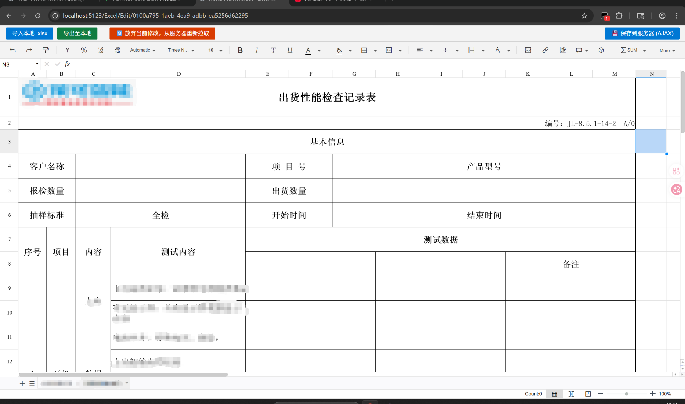

# 📊 DotNet Luckysheet Editor

基于 ASP.NET Core MVC 与 Luckysheet 的在线 Excel 编辑器深度实践方案。

本项目不仅仅是一个简单的官方 Demo 整合，而是**针对实际企业级开发中遇到的各种“深坑”进行了底层修复与优化**。无论你是想在 .NET 项目中接入在线表格，还是正被大体积文件保存失败、导出格式丢失等问题折磨，这个项目都能为你提供现成的解决方案。

  

## ✨ 核心特性 & 解决的痛点

- 🚀 **突破 .NET 提交限制**：彻底解决 ASP.NET Core Kestrel 服务器及 MVC 模型绑定对超大 JSON（30MB+）的体积限制，采用 Fetch API 稳妥保存几十上百兆的表格配置数据。
- 📥 **本地无缝导入**：集成 `LuckyExcel`，支持将本地 `.xlsx` 文件完美解析并渲染到 Web 端。
- 📤 **高保真导出至本地**：集成 `ExcelJS`，重写了导出逻辑。**独家修复**了原生导出方案中多行文本挤压、行高丢失的问题，实现了基于内容感知的动态行高计算。
- 💾 **静默数据同步**：处理了富文本编辑器状态下的失焦保存逻辑，确保用户正在编辑的单元格数据不会在 AJAX 提交时丢失。

## 🛠️ 技术栈

- **后端:** ASP.NET Core (C#), Entity Framework Core, SQL Server
- **前端:** HTML5, CSS3, JavaScript (ES6+), Fetch API
- **核心依赖:**
  - Luckysheet - Web 端核心表格引擎
  - LuckyExcel - Excel 导入解析
  - ExcelJS - Excel 构建与导出

## 🚀 快速开始

### 1. 环境准备

- 安装 .NET SDK (建议 .NET 6.0 或更高版本)
- SQL Server 数据库 (或修改 EF Core 配置使用 SQLite/MySQL)

### 2. 克隆项目

你可以通过 Git 将项目克隆到本地： git clone [https://github.com/你的用户名/DotNet-Luckysheet-Demo.git](https://www.google.com/search?q=https://github.com/你的用户名/DotNet-Luckysheet-Demo.git)

### 3. 配置数据库连接

打开 `appsettings.json`，修改你的数据库连接字符串： "ConnectionStrings": { "ExcelDemoConnection": "Server=你的服务器;Database=ExcelDemoDB;Trusted_Connection=True;TrustServerCertificate=True;" }

### 4. 运行项目

使用 Visual Studio 打开项目，或在命令行依次执行数据库更新和运行命令。启动后，浏览器访问 `/Excel/Edit` 即可体验。

## 💡 核心填坑指南 (避坑必读)

### 坑 1：几十 MB 的表格数据提交到后端变成 `null`？

**原因：** 传统的 Form 提交和 Kestrel 默认限制会拦截超大请求。 **解决方案：** 本项目在 Program.cs 中解除了 Kestrel、IIS 和 FormOptions 的限制，并改用 `application/json` 通过 Fetch 异步提交大体积 Payload。

### 坑 2：缩放整个表格导致鼠标点击选区错位？

**原因：** 绝对不能对外层容器使用 CSS 的 `transform: scale()`，这会破坏 Canvas 的内部坐标系。 **解决方案：** 本项目规范了缩放逻辑，建议在初始化表格时修改数据的 `zoomRatio`，或使用原生自带的底部缩放控件。

### 坑 3：导出 Excel 时多行文本叠在一起？

**原因：** 原始数据的行高配置不够，ExcelJS 不会自动把多行文本撑开。 **解决方案：** 导出逻辑中加入了探测换行符的算法，动态计算行高，强制撑开 Excel 的物理行高。

## 🤝 贡献与支持

如果你在接入 Luckysheet 或 .NET 开发中遇到了新问题，欢迎提交 Issue 或 Pull Request！

如果你觉得这个项目帮到了你，请点个 ⭐️ **Star** 支持一下！

## 📄 开源协议

本项目采用 MIT 协议开源。